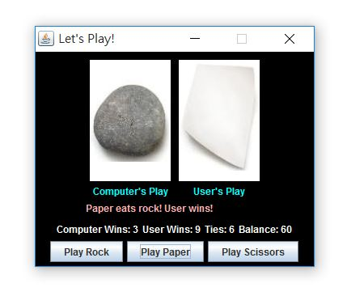

## Rock Paper Scissors GUI
Language: Java  
Clicks the "Rock", "Paper" or "Scissors" button to play with the computer.

 

  

#### Part 1- The RPS Game 
Write a class that represents the game. 

#### Part II- The GUI
Write the GUI program to interact with the user.

### Bonus:
- Ask the player if he or she wants to play with a bet.
- Write a text-based driver program that allows the user to play through the console.

